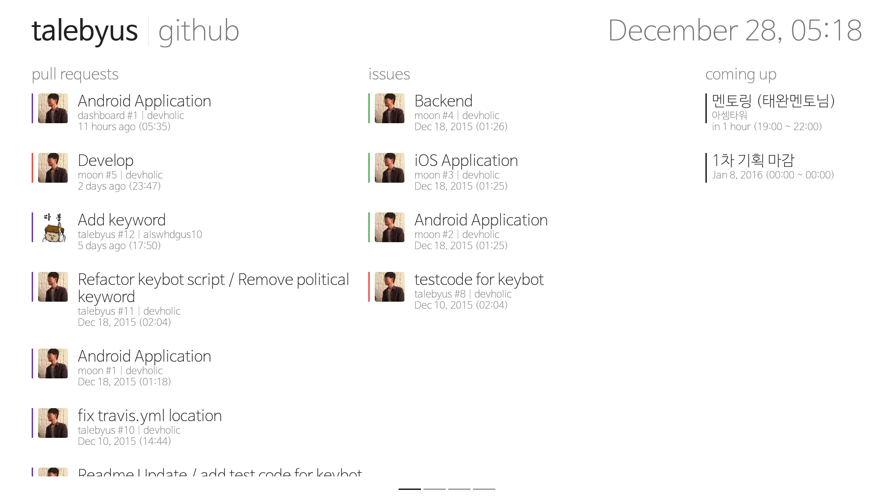

# dashboard

dashboard application for team management

## Integration

### GitHub integration
1. [Create New application](https://github.com/settings/developers) to get token.
2. Set `GITHUB_ORG_NAME`:"Organization Name", `GITHUB_ID`:"Client ID", `GITHUB_SECRET`:"Client Secret" in [GithubResources](https://github.com/talebyus/dashboard/blob/develop/app/src/main/java/us/taleby/dashboard/home/github/GithubResources.java)

### Calendar(iCal) integration
* Set `ical`:"iCal address" in [CalendarResources](https://github.com/talebyus/dashboard/blob/develop/app/src/main/java/us/taleby/dashboard/home/calendar/CalendarResources.java) 